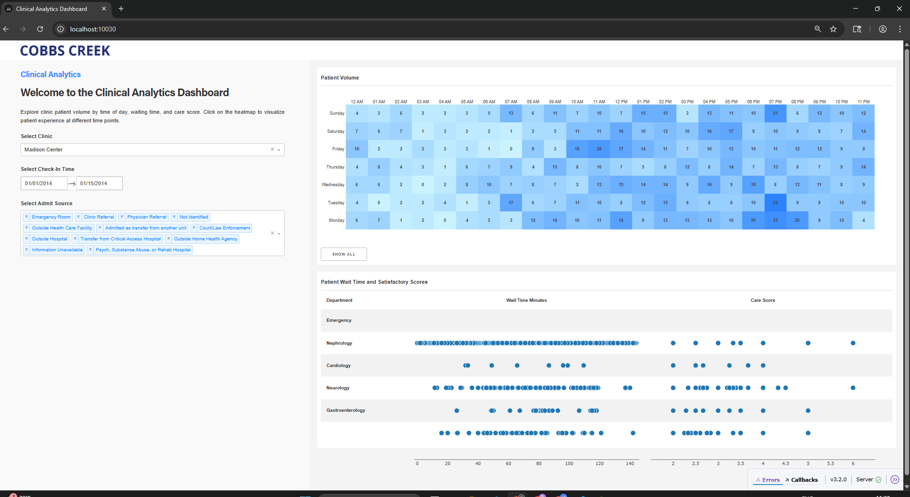

# Clinical Analytics Dashboard

This app is a small Dash web application (Python) that serves a clinical analytics dashboard.  


Below are the instructions to setup the app.

## 0) System packages (fresh Linux)

> These commands work on Ubuntu/Debian. For RHEL/CentOS, swap `apt` for `yum`/`dnf` and install the equivalent packages.

```bash
sudo apt update
sudo apt install -y git curl build-essential ca-certificates
```

---

## 1) Install Python 3.10 with `pyenv` (no system Python required)


```bash
# Install pyenv (single‑user)
curl https://pyenv.run | bash

# Add pyenv to your shell (bash example)
export PATH="$HOME/.pyenv/bin:$PATH"
eval "$(pyenv init -)"
eval "$(pyenv virtualenv-init -)"

# Install Python (matches project constraint: <= 3.11)
pyenv install 3.10.8
pyenv local 3.10.8
python --version   # should print 3.10.8
```

---

## 2) Create a virtual environment and install dependencies (using the fixed `pyproject.toml`)

```bash
# Get the code
git clone https://github.com/diyakithani/Assessment-debugging.git clinical-analytics
cd clinical-analytics

# Create an isolated virtual environment
python -m venv .venv
source .venv/bin/activate

# install from pyproject
python -m pip install .

```

---

## 3) Run the app (listens on port **10030**)

```bash
# From the project root, with the virtual env active
python main.py
```

You should see Dash start and bind to `http://127.0.0.1:10030`